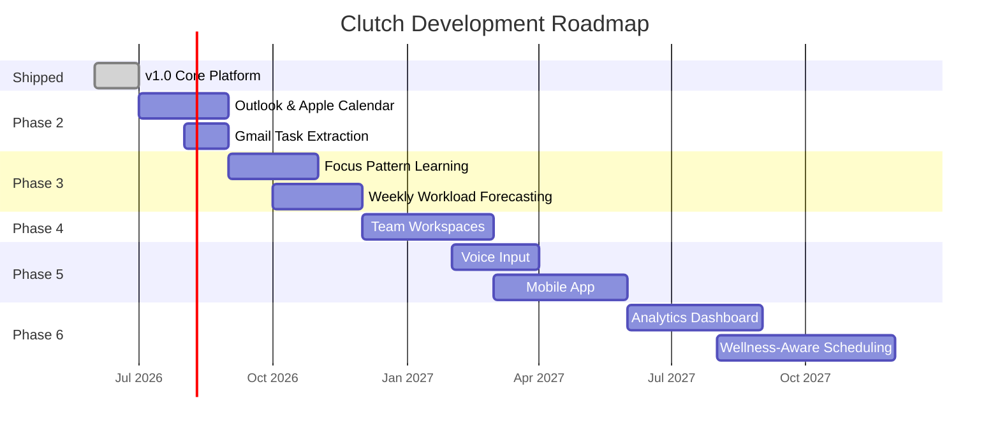

# Future Roadmap — Clutch

> This roadmap extends Clutch's existing architecture into a progressively more capable AI scheduling platform. Every phase is grounded in what the current system already does — no phase introduces unrelated pivots. Features are sequenced by architectural dependency, not by ambition.

---

## Current State (v1.0 — Shipped)

Clutch v1.0 is a full-stack AI scheduling operating system with:
- Natural language task parsing via Gemini
- Dynamic risk scoring engine
- Autonomous focus block scheduling to Google Calendar
- Calendar conflict detection and auto-resolution
- Deterministic fallback engine for Gemini outages
- Demo Mode with local scheduling
- Dual authentication (Google OAuth + Anonymous)
- Agent decision logs with confidence scores
- Diagnostics console with resiliency simulation

The roadmap below assumes v1.0 as the foundation.

---

## Phase 2 — Calendar Ecosystem Expansion

*Target: Q3 2026*

### Features
- **Microsoft Outlook Calendar integration** — OAuth with `Calendars.ReadWrite` scope via Microsoft Graph API
- **Apple Calendar integration** — CalDAV protocol support for iCloud Calendar sync
- **Gmail task extraction** — Gemini scans the user's inbox for deadline signals: "Please submit by Friday", "Your interview is scheduled for..." and surfaces them as suggested tasks
- **Email-based reminders** — Scheduled emails sent from the backend when a task crosses a risk threshold, for users who prefer inbox-based notifications

### Why It Matters
Google Calendar is the current single point of integration. A significant proportion of professionals — particularly those in enterprise environments — use Outlook as their primary calendar. Without Outlook support, Clutch cannot schedule into the calendar that actually governs their workday, making the scheduling agent's output irrelevant to their real schedule.

Gmail task extraction closes the loop between where deadlines arrive (email) and where they are managed (Clutch). It removes the manual entry step entirely for the most common deadline source.

### Technical Feasibility
**High.** The scheduling agent is already abstracted from the calendar provider — it operates on a normalised free/busy representation. Adding Outlook requires implementing the Microsoft Graph OAuth flow and mapping Graph API event objects to the existing internal `CalendarEvent` type. The scheduling logic requires no changes.

Gmail integration requires a new `gmail.readonly` OAuth scope and a Gemini prompt that classifies email content for deadline signals — a straightforward extension of the existing `/api/gemini/parse-task` endpoint pattern.

### Expected User Impact
Doubles the addressable user base by supporting Outlook. Reduces task entry friction from ~30 seconds (manual input) to near-zero (auto-extracted from email).

---

## Phase 3 — Adaptive Productivity Intelligence

*Target: Q4 2026*

### Features
- **Focus pattern learning** — The agent observes which time slots produce completed focus sessions versus abandoned ones. Over 2–4 weeks, it builds a per-user model of productive hours by day of week, task category, and energy level
- **Personalised scheduling recommendations** — Rather than scheduling focus blocks in the next available slot, the agent schedules into the user's historically productive windows
- **Weekly workload forecasting** — Every Sunday evening, the agent analyses the upcoming week's tasks and deadlines, flags overload risks before they become crises, and suggests task deferrals or scope reductions
- **AI-generated study and work plans** — For long-horizon tasks (e.g., exam preparation, a multi-week project), Gemini generates a staged plan broken into daily milestones, which the agent then schedules across the available calendar

### Why It Matters
v1.0 Clutch is reactive — it responds to deadlines as they approach. Phase 3 makes it proactive. The difference between a tool that helps you survive the week and one that helps you plan it is the difference between crisis management and genuine productivity improvement.

Personalised scheduling is also the feature that separates Clutch from a calendar assistant that simply fills gaps. Scheduling a DBMS assignment at 11pm when the user's telemetry shows they never complete high-complexity work after 9pm is a scheduling mistake, not a scheduling success.

### Technical Feasibility
**Medium.** Focus pattern learning requires accumulating sufficient telemetry — Clutch already logs agent decisions and task completions in `users/{uid}/logs`. The pattern analysis layer needs a new Gemini prompt that processes this log history and extracts a per-user productivity profile, stored in the user's Firestore document.

The primary complexity is cold start: the system needs 2–4 weeks of data before personalisation becomes meaningful. A sensible default scheduling heuristic (avoid scheduling high-complexity tasks outside 9am–9pm) covers the cold start period.

### Expected User Impact
Reduction in task abandonment for scheduled focus sessions. Users who reach Phase 3 maturity in data accumulation should see measurably fewer missed deadlines compared to v1.0.

---

## Phase 4 — Team Workspaces

*Target: Q1 2027*

### Features
- **Team workspaces** — A shared workspace where team members each have their own task matrix, visible to workspace members with appropriate permissions
- **Shared focus sessions** — The scheduling agent can propose a shared focus block — a time slot where all specified team members are free simultaneously — and create a single calendar event for all of them
- **Collaborative sprint planning** — A team lead can define a sprint with a set of tasks. Clutch distributes tasks across team members based on their individual risk scores and calendar availability
- **Team scheduling dashboard** — A read-only aggregate view showing all team members' current risk scores, upcoming deadlines, and calendar load. Surfaces who is overloaded before it becomes a blocker

### Why It Matters
Deadline pressure in professional contexts is rarely individual. A team member missing a deadline affects everyone downstream. The same autonomous scheduling intelligence that helps individuals should be able to coordinate across teams.

Shared focus sessions address the coordination overhead of deep work — the back-and-forth of finding a time when multiple people can work together without interruption is a problem Clutch's free/busy engine already solves for one calendar.

### Technical Feasibility
**Medium-High.** The Firestore data model requires a new `workspaces/{workspaceId}` collection with member references and shared task documents. The scheduling agent's free/busy query needs to accept multiple calendar IDs and find the intersection of availability — a straightforward extension of the existing Calendar API call pattern.

Permission modelling is the primary complexity: task visibility (who can see what), action permissions (who can reschedule whom), and workspace admin roles. This is implementable with Firestore security rules but requires careful schema design upfront.

### Expected User Impact
Extends Clutch's value proposition from individual productivity to team delivery. Opens the product to team and enterprise segments.

---

## Phase 5 — Voice and Native Platforms

*Target: Q2 2027*

### Features
- **Voice assistant integration** — Users can dictate tasks hands-free: "Add: finish the literature review, due Thursday at 6pm, high complexity"
- **Speech-to-task capture** — Gemini's multimodal audio capability transcribes and parses spoken input through the same `/api/gemini/parse-task` pipeline, returning a structured task object
- **Mobile companion application** — A native iOS and Android app built on React Native, sharing the existing TypeScript service layer. Optimised for on-the-go task capture, push notifications, and a single-column risk dashboard
- **Desktop application** — An Electron wrapper around the existing React build with system tray integration, native notifications, and keyboard shortcut support for task ingestion without opening a browser tab

### Why It Matters
The primary use case for adding a task in Clutch is a moment of context-switch: someone receives a new deadline while already occupied. Voice capture removes the friction of stopping what you are doing to type. A task added by voice in 5 seconds is far more likely to be added than one requiring a browser tab switch and form entry.

A native mobile app makes push notifications first-class rather than browser-dependent. The scheduling agent's alerts become more reliable and more immediate on mobile.

### Technical Feasibility
**Medium.** Voice integration via Gemini multimodal audio is a relatively well-defined API surface. The structural challenge is UI design — voice input requires a different affordance than a text field, and error recovery (misheard deadlines, ambiguous dates) needs a confirmation flow.

React Native reuse of the TypeScript service layer (`firebase.ts`, `gemini.ts`) is high — the services have no browser-specific dependencies. The UI layer would need to be rebuilt for native primitives, which represents the majority of the development effort.

### Expected User Impact
Voice capture meaningfully increases task capture rate — the most critical metric for a deadline tool, since a task that is not captured cannot be managed. Native mobile extends daily active usage beyond desktop work sessions.

---

## Phase 6 — Wellness-Aware Scheduling

*Target: Q4 2027*

### Features
- **Wearable integration** — Optional connection to fitness platforms (Google Fit, Apple Health) to surface sleep quality and activity data as scheduling context signals
- **Productivity analytics dashboard** — A weekly and monthly view of task completion rates, near-miss events, risk score distributions, and scheduling efficiency. Exportable as a PDF report
- **Habit prediction** — The agent learns recurring task patterns (weekly reports, daily standups, monthly reviews) and pre-creates task entries with estimated complexity before the user manually enters them
- **Burnout detection** — The system monitors for sustained high-risk scores, consistently missed focus sessions, and task accumulation without completion. When a threshold pattern is detected, the agent surfaces a workload alert and suggests task deferrals or scope reductions rather than scheduling more focus blocks
- **Wellness-aware scheduling** — Focus blocks are not scheduled during periods of predicted low energy (post-lunch windows, late evenings) unless the user overrides. High-complexity tasks are weighted toward the user's historically productive periods from Phase 3

### Why It Matters
A system that optimises purely for deadline completion, without regard for the human cost of that optimisation, can produce outcomes that are technically correct and personally damaging. Scheduling a high-complexity task at 11pm because a deadline is tomorrow may technically help the user complete the task — but if it is part of a pattern of late-night overwork, the tool is contributing to burnout rather than preventing it.

Wellness-aware scheduling is not a softening of Clutch's urgency focus. It is a more sophisticated model of productivity: one that accounts for the fact that a person operating at low capacity is less effective than one who has managed their workload sustainably.

### Technical Feasibility
**Medium-Low for analytics, High-complexity for wellness signals.** The analytics dashboard is straightforwardly buildable from existing telemetry data in `users/{uid}/logs`. Habit prediction is an extension of the Phase 3 pattern learning model.

Wearable integration is the highest-complexity feature in the roadmap. Health data APIs (Google Fit, Apple HealthKit) have strict privacy requirements, platform-specific implementations, and user consent flows that add significant engineering surface. This feature is listed last because it is the most technically demanding and the most sensitive in terms of data handling.

Burnout detection is a pattern-matching problem over existing Firestore data — sustained high-risk scores and completion rates. The detection logic itself is deterministic; the user-facing communication requires careful UX design to avoid being alarmist.

### Expected User Impact
Phase 6 represents the transition from Clutch as a crisis-response tool to Clutch as a long-term productivity operating system. Users who reach this phase have months of data and a system that understands their work patterns as well as any external tool can. The goal is a measurable reduction in both missed deadlines and overwork incidents over a sustained period.

---

## Roadmap Summary

---

## What This Roadmap Does Not Include

The following were considered and excluded:

- **Cryptocurrency or blockchain task verification** — no user problem it solves
- **Social/public task sharing** — task data is inherently private; public visibility creates privacy risk with no clear productivity benefit
- **GPT or non-Gemini model support** — the architecture is built on Google's ecosystem; multi-model support adds complexity without addressing a user need
- **Gamification (points, badges, streaks)** — Clutch's identity is a serious operational tool. Gamification elements would undermine the interface philosophy and dilute the urgency signal

The roadmap extends what Clutch is, not what it could be repositioned as.
