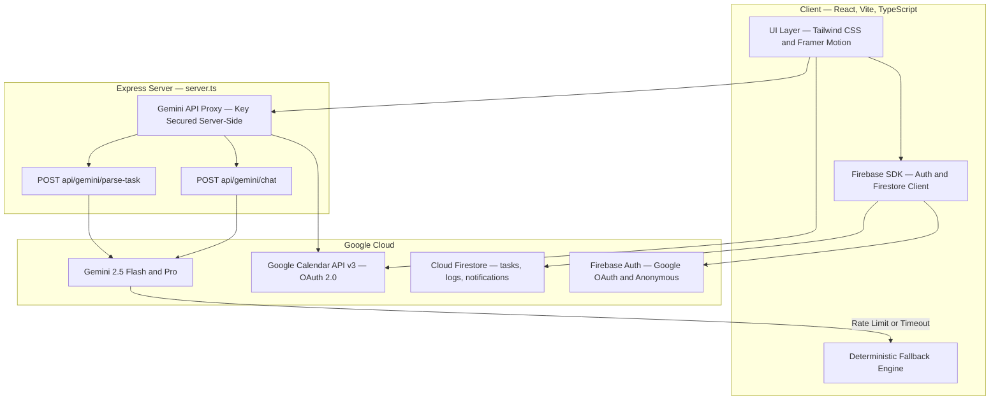
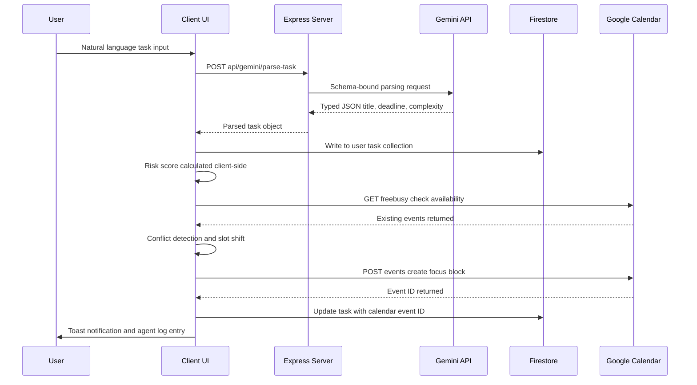
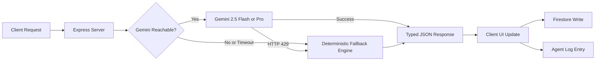

# CLUTCH — AI Deadline Survival System

<div align="center">

**`// YOUR DEADLINES ARE WATCHING.`**

[](https://ai.google.dev/)
[](https://firebase.google.com/)
[](https://react.dev/)
[](https://vitejs.dev/)
[](https://aistudio.google.com/)

*Submitted for Vibe2Ship — Coding Ninjas × Google for Developers Hackathon*
*Problem Statement 1: The Last-Minute Life Saver*

</div>

---

## What is Clutch?

Clutch is an **autonomous AI scheduling operating system** that transforms passive task lists into a self-healing, real-time deadline management system. It does not remind you — it intervenes.

Unlike traditional productivity tools that rely on static reminders, Clutch operates a continuous background agent loop that:

- Parses tasks from natural language in real time
- Computes dynamic risk scores based on deadline proximity and task complexity
- Autonomously schedules focus blocks directly into Google Calendar
- Detects and resolves calendar conflicts without user intervention
- Switches to a hyper-pragmatic crisis mode for high-risk scenarios
- Falls back to a deterministic local engine if Gemini is unavailable

> Clutch is designed for the moment when everything is due at once and no tool is helping.

---

## Demo

| Screen | Description |
|---|---|
| **Landing** | Animated particle constellation, 4-leaf clover logo, system boot aesthetic |
| **Auth** | Dual-flow: Google OAuth (full Calendar sync) or Demo Mode (local scheduling) |
| **Dashboard** | Operational Task Matrix — live risk scores, timers, rescheduling state |
| **Task Command Center** | Animated risk dial, micro-action checklist, AI Decision Coach |
| **Agent Logs** | Full timeline of every autonomous decision with confidence scores |
| **Diagnostics** | Live terminal feed, resiliency simulator, calendar pipeline audit |

---

## Key Features

### Autonomous Agent Architecture
The scheduling agent operates continuously. When the system detects stalling progress against an approaching deadline, it autonomously locates available calendar slots, schedules a 45-minute focus block, resolves any conflicts by shifting to the next gap, and writes the event directly to Google Calendar — all without user intervention.

### Natural Language Task Ingestion
Tasks are entered as plain sentences. The Gemini-powered parser (`/api/gemini/parse-task`) extracts title, category, deadline, estimated duration, and initial complexity with zero configuration required.

```
"Finish DBMS assignment tomorrow 8 PM, high complexity"
→ { title, category: ACADEMIC, deadline: ISO UTC, estimatedHours, complexity: HIGH }
```

### Dynamic Risk Assessment Engine
Every task carries a live risk score (0–100%) computed from deadline proximity and complexity ratio. Scores update continuously and drive the color hierarchy across the entire interface — from card borders to the animated dial in the Task Command Center.

| Score | State | UI Signal |
|---|---|---|
| 0–30 | **Safe** | Green accent |
| 31–60 | **Warning** | Amber accent |
| 61–85 | **High Risk** | Red accent |
| 86–100 | **Crisis** | Crisis system prompt activated |

### AI Decision Coach
A context-aware conversational AI sidebar that understands the full task context — deadline, progress, calendar availability, and risk level. In high-risk scenarios it automatically switches to a triage mode: 3 specific, executable steps and a direct booking confirmation for the next calendar slot.

### Deterministic Fallback Engine
If Gemini returns a 429 rate limit or is unreachable, the system silently switches to a local regex-based parser with static scheduling rules. Users experience no interruption. A recovery agent monitors service restoration and re-processes any queued requests.

### Dual Authentication
- **Google OAuth** — Full Calendar read/write, real focus blocks, persistent Firestore profile
- **Demo Mode** — Anonymous sign-in, local workspace scheduling, no credentials required. Suitable for live demos and first-time evaluation

### Diagnostics Console
A developer-grade terminal interface with live log streaming, outage simulation controls (Calendar 503, OAuth expiry, Gemini timeout), and a Google Calendar pipeline audit showing auth state, token validity, and sync history.

---

## System Architecture



---

## Data Flow



---

## AI Pipeline



---

## Tech Stack

| Layer | Technology | Purpose |
|---|---|---|
| **Frontend** | React 18 + TypeScript + Vite | SPA with strict type safety |
| **Styling** | Tailwind CSS | Utility-first, dark theme token system |
| **Animation** | Framer Motion | Page transitions, micro-interactions, particle system |
| **Backend** | Node.js + Express (`server.ts`) | Secure Gemini proxy, header sanitisation |
| **AI Model** | Gemini 2.5 Flash / Gemini 2.5 Pro | Task parsing, coaching, risk reasoning |
| **AI SDK** | `@google/genai` TypeScript SDK | Server-side Gemini integration |
| **Auth** | Firebase Auth | Google OAuth + Anonymous sign-in |
| **Database** | Cloud Firestore | Real-time task sync, offline-first |
| **Calendar** | Google Calendar REST API v3 | Bi-directional focus block scheduling |
| **Deploy** | Google AI Studio + Cloud Run | Production hosting, scalable container runtime |

---

## Google Technologies Used

- **Google AI Studio** — Primary build and deployment platform
- **Gemini 2.5 Flash / Pro** — Task parsing, AI coaching, risk assessment, structured output
- **Firebase Authentication** — Dual-flow identity (Google OAuth + Anonymous)
- **Cloud Firestore** — Real-time NoSQL database with offline persistence
- **Google Calendar API v3** — Autonomous focus block scheduling and conflict resolution
- **Google OAuth 2.0** — Scoped calendar access (`calendar`, `calendar.events`)
- **Cloud Run** — Containerised Express server runtime

---

## Project Structure

```
clutch/
├── .env.example                 # Environment variable template
├── firestore.rules              # Granular per-user security rules
├── package.json                 # Dependencies + build scripts
├── server.ts                    # Express proxy — Gemini API gateway
└── src/
    ├── App.tsx                  # Root application controller + routing
    ├── main.tsx                 # Client entry point
    ├── types.ts                 # Shared TypeScript interfaces and enums
    ├── components/
    │   ├── UndoNotification.tsx # Animated toast with undo action support
    │   └── AvatarPicker.tsx     # Visual persona selector (Oracle / Specter / Ghost / Viper)
    ├── services/
    │   ├── firebase.ts          # Firestore, Auth, scheduling agent
    │   └── gemini.ts            # AI wrappers + deterministic fallback parser
    └── pages/
        ├── Landing.tsx          # Boot screen and system initialisation
        └── Dashboard/           # Core workspace — Task Matrix, Coach, Diagnostics
```

---

## Getting Started

### Prerequisites
- Node.js 18+
- A Firebase project with Firestore and Authentication enabled
- A Google Cloud project with Calendar API enabled
- A Gemini API key (from [Google AI Studio](https://aistudio.google.com/))

### Environment Setup

Copy `.env.example` and populate:

```env
GEMINI_API_KEY=your_gemini_api_key
VITE_FIREBASE_API_KEY=your_firebase_api_key
VITE_FIREBASE_AUTH_DOMAIN=your_project.firebaseapp.com
VITE_FIREBASE_PROJECT_ID=your_project_id
VITE_FIREBASE_STORAGE_BUCKET=your_project.appspot.com
VITE_FIREBASE_MESSAGING_SENDER_ID=your_sender_id
VITE_FIREBASE_APP_ID=your_app_id
VITE_GOOGLE_CLIENT_ID=your_google_oauth_client_id
```

### Install and Run

```bash
# Install dependencies
npm install

# Start development server (client + Express server)
npm run dev

# Production build
npm run build

# Deploy Firestore security rules
firebase deploy --only firestore:rules
```

### Firestore Security Rules
Rules are pre-configured in `firestore.rules`. Each user can only access their own `tasks`, `logs`, and `notifications` collections, enforced server-side by Firebase.

---

## Evaluation Criteria Alignment

| Criterion | Weight | How Clutch Addresses It |
|---|---|---|
| Problem Solving & Impact | 20% | Replaces passive reminders with an active autonomous scheduling system |
| Agentic Depth | 20% | Continuous scheduling agent, conflict resolution, self-healing recovery, agent log |
| Innovation & Creativity | 20% | Dynamic risk scoring, deterministic fallback engine, OS-aesthetic UI |
| Usage of Google Technologies | 15% | Gemini, Firebase Auth, Firestore, Calendar API, AI Studio, Cloud Run |
| Product Experience & Design | 10% | Premium AI OS interface, Framer Motion system, responsive layouts |
| Technical Implementation | 10% | TypeScript throughout, server-side proxy, offline-first, security rules |
| Completeness & Usability | 5% | Full demo flow, Demo Mode for judges, production-ready audit complete |

---

## License

MIT — see [LICENSE](LICENSE) for details.

---

<div align="center">

Built for **Vibe2Ship 2026** — Coding Ninjas × Google for Developers

*From prompt to production.*

</div>
